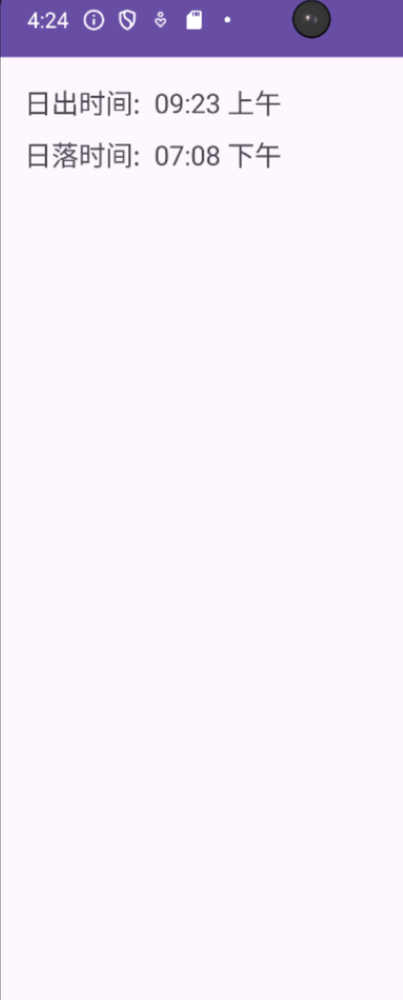

Kotlin course. Lab extra 

# About

I did translation using knowledge that I learned from the lectures and example code.
Also I changed old project into new project cause of failure to gradle syncing project.
Overall this is good hands on lab to test internationalization

Here is example:

##Required
SDK version 33 and java needed